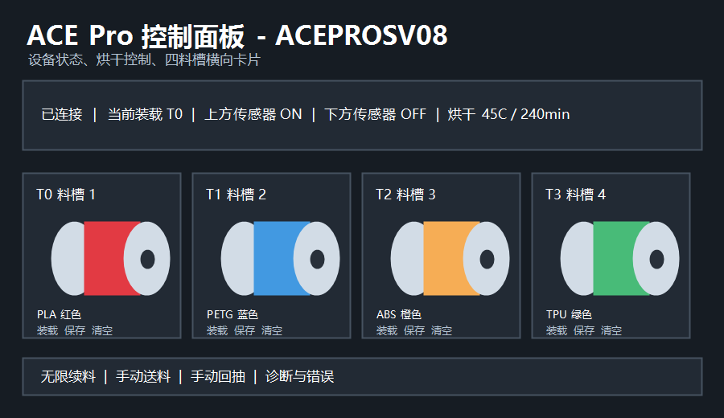

# fluidd-acepro-card-ACEPROSV08

> 本项目仅适配 `szkrisz/ACEPROSV08` 驱动的单 ACE Pro、四料槽配置。
> 不兼容 `Kobra-S1/ACEPRO`，请勿混合安装两套驱动。

这是为 DIY Klipper 打印机准备的 ACE Pro Fluidd 集成包。它把 ACE Pro 的状态、烘干、料槽、库存保存、手动送料/回抽、无限续料和诊断能力放进 Fluidd，同时提供中文独立控制页面 `/ace.html`。

## 兼容性

| 项目 | 当前版本 |
| --- | --- |
| ACE 驱动 | `szkrisz/ACEPROSV08`，基线提交 `0311eb3` |
| Fluidd | 基于 `v1.37.2` 完整源码重新构建 |
| ACE 数量 | 第一版仅支持 1 台 ACE Pro |
| 料槽数量 | 4 个 |
| 语言 | 中文 |
| 许可证 | GPL-3.0 |

## 功能

- Fluidd 仪表盘内嵌 ACE Pro 卡片。
- 中文 `/ace.html` 独立控制页面。
- 卡片与独立页面均支持设备状态、上下传感器、烘干、料槽编辑、装卸、换卷、助推、手动送料/回抽、无限续料和传感器诊断。
- Moonraker 统一 API：`/server/ace/status`、`/server/ace/slots`、`/server/ace/capabilities`、`/server/ace/command`。
- 严格命令白名单，不允许网页执行任意 G-code。
- ACEPROSV08 库存指令使用 `ACE_SET_SLOT INDEX=...`，不使用 Kobra-S1 旧写法 `T=...`。
- 安装、强制安装、卸载、状态检查均通过字符菜单完成。
- 所有实际写入前都会创建备份；卸载时按“原文件存在或不存在”恢复首次安装前状态，新增文件会移入卸载备份而不会直接删除。

## 安装

在打印机 SSH 中执行：

```bash
cd ~
git clone --depth 1 https://github.com/Luomo520/fluidd-acepro-card-ACEPROSV08.git
cd fluidd-acepro-card-ACEPROSV08
sh ui-installer.sh
```

菜单选项：

```text
1. 安装 / 更新 ACE Pro 界面
2. 强制安装（跳过驱动和 API 检测）
3. 卸载界面并恢复安装前版本
4. 检查安装状态
5. 退出
```

强制安装只适合驱动已经存在、但检测 API 暂时失败的场景。它会跳过驱动和 API 检测，但仍会检查文件、创建备份，不会跳过备份。

## 备份与恢复

备份目录：

```bash
~/.local/share/aceprosv08-ui/backups/
```

安装器会备份：

- 当前 Fluidd 目录。
- `moonraker.conf`。
- 已存在的 `ace_status.py` Moonraker 组件。
- 已存在的 ACE 独立网页资源。

首次安装备份会作为只读恢复基线。更新和卸载会另外创建新备份，不会覆盖或改写这份基线。

卸载：

```bash
cd ~/fluidd-acepro-card-ACEPROSV08
sh ui-installer.sh --uninstall
```

或：

```bash
sh uninstall.sh
```

## 更新

```bash
cd ~/fluidd-acepro-card-ACEPROSV08
git pull --ff-only
sh ui-installer.sh
```

更新前同样会备份当前文件。

## Moonraker 配置

安装器会在 `moonraker.conf` 中追加：

```ini
[ace_status]
upper_sensor_name: extruder_sensor
lower_sensor_name: toolhead_sensor
```

如果你的传感器对象名称不同，请安装后手动修改这两个名称，然后重启 Moonraker。

## API 与命令

前端只调用：

```text
GET  /server/ace/status
GET  /server/ace/slots
GET  /server/ace/capabilities
POST /server/ace/command
```

允许的主要命令：

```text
ACE_SET_SLOT
ACE_QUERY_SLOTS
ACE_SAVE_INVENTORY
ACE_CHANGE_TOOL
ACE_CHANGE_SPOOL
ACE_FEED
ACE_RETRACT
ACE_ENABLE_FEED_ASSIST
ACE_DISABLE_FEED_ASSIST
ACE_START_DRYING
ACE_STOP_DRYING
ACE_ENABLE_ENDLESS_SPOOL
ACE_DISABLE_ENDLESS_SPOOL
ACE_GET_CURRENT_INDEX
ACE_TEST_RUNOUT_SENSOR
```

## 截图



> 配图为隐私安全的界面结构示意图，实际颜色和间距以 Fluidd 主题及浏览器宽度为准。

## 构建与验证

本版本已完成：

- Fluidd 全量测试：14 个测试文件、326 项测试通过。
- Fluidd `vue-tsc --build --noEmit` 类型检查通过。
- Fluidd 全量 ESLint 检查通过。
- Fluidd v1.37.2 `vite build` 与 PWA Service Worker 构建通过。
- Python 3.11 Moonraker API 契约测试 6 项通过，两个 Python 文件编译通过。
- Bash 语法检查，以及隔离假 `HOME` 中的普通安装、强制更新、卸载恢复测试通过。

## 故障排查

- Fluidd 没出现卡片：确认你访问的是安装器实际替换的 `FLUIDD_ROOT`，并清除浏览器缓存或 Service Worker。
- Moonraker 提示 `[ace_status]` 未解析：确认 `~/moonraker/moonraker/components/ace_status.py` 存在，然后重启 Moonraker。
- 保存颜色后恢复旧值：检查 Moonraker 日志中的具体命令错误；本版本会显示 API 失败，不再把失败结果当作保存成功。
- API 404：重新运行安装器，或使用强制安装后检查 Moonraker 组件路径。

## 开源说明

本项目基于 GPL-3.0 发布，包含来自 `szkrisz/ACEPROSV08`、`Kobra-S1/ACEPRO` 和 `fluidd-core/fluidd` 的代码、界面与样式迁移。详细来源见 [THIRD_PARTY_NOTICES.md](THIRD_PARTY_NOTICES.md)。
