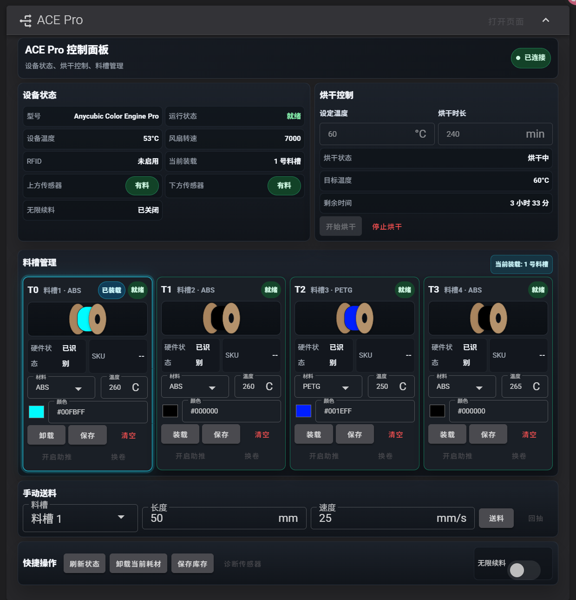
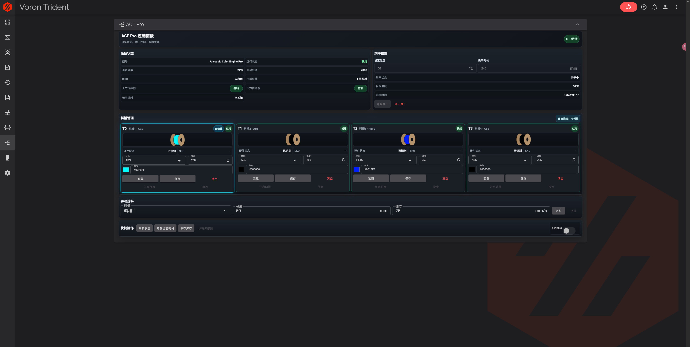

# ACE Pro for Fluidd (ACEPROSV08)

为 DIY Klipper 打印机提供 ACE Pro 单设备四色管理能力，并把控制面板作为原生模块嵌入 Fluidd。

本项目不是新的打印机网页，也不会用独立站点替代 Fluidd。安装后，ACE Pro 会出现在 Fluidd 导航和仪表盘中；`/ace.html` 仅作为备用的独立控制入口。

本项目不兼容 `Kobra-S1/ACEPRO`，不得与该驱动同时加载。

> [!IMPORTANT]
> 本项目只适配基于 `szkrisz/ACEPROSV08` 的单台 ACE Pro、四料槽方案，不兼容同时加载 `Kobra-S1/ACEPRO` 驱动。安装前必须停止打印，并确认切刀坐标、传感器名称和耗材路径长度适合自己的机器。

## 界面预览

### ACE Pro 卡片



### Fluidd 完整仪表盘



## 项目来源

本仓库是在多个 GPL-3.0 开源项目基础上完成的适配和集成，不是 Anycubic、Fluidd、Moonraker 或上游驱动作者的官方发布。

| 项目 | 许可证 | 本项目中的用途 |
| --- | --- | --- |
| [szkrisz/ACEPROSV08](https://github.com/szkrisz/ACEPROSV08) | GPL-3.0 | Klipper ACEPROSV08 驱动、串口协议、G-code 命令和配置结构的基础 |
| [Kobra-S1/ACEPRO](https://github.com/Kobra-S1/ACEPRO) | GPL-3.0 | 参考网页控制流程、中文交互方式和料卷视觉样式，并改写为 ACEPROSV08 单设备 `INDEX` 指令 |
| [fluidd-core/fluidd](https://github.com/fluidd-core/fluidd) | GPL-3.0 | Fluidd 页面、仪表盘、导航、构建流程和主题体系 |
| [Moonraker](https://github.com/Arksine/moonraker) | GPL-3.0 | 在 Fluidd 与 Klipper 驱动之间提供受控状态和命令接口 |
| [Vue](https://github.com/vuejs/core) | MIT | `/ace.html` 辅助页面运行时 |

详细第三方来源和修改边界见 [THIRD_PARTY_NOTICES.md](THIRD_PARTY_NOTICES.md)。

## v1.1.0 特色功能

- 自动跟随打印：打印开始自动烘干，打印完成、取消或错误后停止自动拥有的烘干任务；暂停打印时保持运行。
- 全部 PLA：45°C。
- PLA 与其他材料混装：50°C，保护 PLA，并提示其他材料的烘干效果可能受限。
- 未知材料：45°C，并提示烘干效果可能受限。
- 高温材料：60°C，包括 ABS、ABSCF、PETG、PAHTCF、PETCF 和 PEEK，实际温度不会超过 `max_dryer_temperature`。
- 手动启动的烘干不会被自动停止，也不会被自动功能接管。
- USB 断联或命令失败不会暂停打印；请求按 30 秒退避并最多重试三次，打印结束后的待停止任务会在重连后继续处理。
- 完整流程见 [自动跟随打印烘干流程](docs/AUTO_DRYING_FLOW.zh-CN.md)，驱动边界和验证说明见 [驱动 v1.1.0 更新说明](docs/DRIVER-v1.1.0.zh-CN.md)。

## v1.0.0 基础功能

- Fluidd 原生集成：ACE Pro 作为 Fluidd 卡片和导航页面运行，不需要打开另一套管理网站。
- 四料槽管理：显示并编辑槽位颜色、材料和温度，支持装载、卸载、清空、换卷和库存保存。
- 双传感器状态：分别显示挤出机上方传感器和下方传感器，避免把“到达挤出机入口”误判为“已经到达喷嘴”。
- 烘干控制：显示设备温度、目标温度、烘干状态和剩余时间，可直接开始或停止烘干。
- 手动操作：按槽位设置送料或回抽的距离与速度，并提供辅助送料和无限续料控制。
- 连续送料：默认取消每 50/100 mm 的固定停顿，主路径和有限打滑补偿分别使用完整请求。
- 两阶段回抽：默认只执行快速回抽段和慢速停放段，不再每 100 mm 停顿。
- 动态停止等待：上方传感器触发并停止送料后，按请求时长等待 ACE 恢复 `ready`，避免慢速补偿被普通超时误判。
- 换料诊断：控制台显示 `TA -> TB`、切刀、工具头回抽、Bowden 回收、上/下传感器送料和失败位置。
- 断联保护：不盲目重放状态不确定的物理动作；打印中发生故障时优先暂停并保留恢复条件。
- 距离标定：从上下传感器计算送料上界和五通估算停放距离，结果确认后才保存。
- 冷态预装载：可在不加热、不归零、不移动 XY/Z 和不切刀的情况下送到下方传感器。
- 槽位位置：分别记录四个料槽处于 ACE 内部、五通预停放、上方传感器、挤出机或喷嘴。
- 事务式安装：安装前归档当前文件；更新、卸载和回滚同样建立 `old/` 归档，失败时自动恢复。
- 中文界面：卡片、辅助页面、安装器、驱动提示和主要文档均使用简体中文。

## 兼容范围

| 项目 | 支持情况 |
| --- | --- |
| 打印机 | DIY Klipper 3D 打印机 |
| ACE 数量 | 1 台 |
| 料槽数量 | 4 个，T0-T3 |
| Klipper 驱动 | 本仓库内置的增强版 `szkrisz/ACEPROSV08` |
| Moonraker | 使用本仓库内置 `ace_status` 组件 |
| Fluidd | 已完整测试 `v1.37.2` |
| 其他 Fluidd 版本 | 安装器会显示升级或降级风险，由用户决定继续或取消 |
| Kobra-S1/ACEPRO | 不可与本驱动同时加载 |
| 多台 ACE Pro | v1.1.0 不支持 |

安装卡片时会部署基于 Fluidd `v1.37.2` 构建的完整前端。当前 Fluidd 低于、高于或无法识别该版本时，安装器都会先提示风险，并保留回滚文件。

## 安装前准备

1. 停止打印，确认没有正在执行的送料、回抽、切刀或工具切换。
2. 确认 Klipper、Moonraker 和 Fluidd 已安装并可正常访问。
3. 确认 ACE Pro 使用稳定的 USB 数据线，并优先使用 `/dev/serial/by-id/...` 串口路径。
4. 记录上方传感器、下方传感器、切刀坐标和各段耗材路径长度。
5. 已经可以正常换料的机器，安装时优先选择“保留现有 ace.cfg”。

可选检查：

```bash
ls -l /dev/serial/by-id/
grep -n "include.*ace" ~/printer_data/config/printer.cfg
grep -Rni "^\[ace\]" ~/printer_data/config
```

## Git 安装

首次安装当前稳定版：

```bash
cd ~
git clone --branch v1.0.0 --depth 1 \
  https://github.com/Luomo520/fluidd-acepro-card-ACEPROSV08.git
cd fluidd-acepro-card-ACEPROSV08
sh install.sh
```

跟随仓库最新版本：

```bash
cd ~
git clone --depth 1 \
  https://github.com/Luomo520/fluidd-acepro-card-ACEPROSV08.git
cd fluidd-acepro-card-ACEPROSV08
sh install.sh
```

安装器会显示 Fluidd 版本、驱动版本、安装包版本、ACE API 状态、安装状态和最近归档。

| 选项 | 作用 |
| ---: | --- |
| 1 | 安装或更新整套组件，保留当前 `ace.cfg`，推荐已有配置的机器使用 |
| 2 | 仅安装或更新 ACEPROSV08 驱动和配置 |
| 3 | 仅安装或更新 Fluidd 卡片、Moonraker 适配层和辅助页面 |
| 4 | 整套安装并用新版模板替换 `ace.cfg`，仅用于准备重新标定的机器 |
| 5 | 强制整套安装，只跳过驱动/API 判断，不跳过校验、备份和失败恢复 |
| 6 | 回滚到最近一次安装前版本 |
| 7 | 卸载并恢复首次安装前版本 |
| 8 | 检查安装状态 |
| 9 | 退出 |

安装器不会自动重启 Klipper 或 Moonraker。确认没有打印任务后执行：

```bash
sudo systemctl restart klipper
sudo systemctl restart moonraker
```

完整安装说明见 [中文安装、升级与恢复教程](docs/INSTALL.zh-CN.md)。

## 必填配置

耗材路径：

```text
送料：ACE T0-T3 -> 公共管路 -> 上方传感器 -> 挤出机 -> 下方传感器 -> 喷嘴
回收：喷嘴 <- 下方传感器 <- 挤出机 <- 上方传感器 <- 公共管路 <- ACE
```

安装或更新后检查：

```bash
nano ~/printer_data/config/ace.cfg
```

| 参数 | 必须确认的内容 |
| --- | --- |
| `serial` | ACE Pro 的 `/dev/serial/by-id/...` 路径 |
| `extruder_sensor_pin` | 挤出机上方传感器 MCU 引脚 |
| `toolhead_sensor_pin` | 挤出机下方传感器 MCU 引脚 |
| `toolchange_load_length` | ACE 停放位置到上方传感器的最大送料距离 |
| `toolchange_retract_length` | 足以释放公共通道的回抽总距离 |
| `bowden_tube_length` | ACE 出料口到五通进料口的实际 PTFE 管路长度；少量误差由上方传感器闭环修正 |
| `toolhead_sensor_to_nozzle` | 下方传感器到喷嘴的送料距离 |
| `CUT_TIP` 坐标 | 本机切刀的真实 X/Y 位置，禁止直接照抄其他机器 |

v1.0.0 推荐模式：

```ini
intermittent_feed: False
intermittent_retract: False
ace_ready_timeout: 15
ace_stop_ready_timeout: 25
```

- `intermittent_feed: False`：ACE 长距离送料使用完整请求并实时监测上方传感器。
- `intermittent_retract: False`：长距离回抽只保留快速段和慢速停放段。
- `ace_stop_ready_timeout`：停止送料后的最短等待时间；驱动还会按“距离/速度 + 3 秒”动态延长。

全部速度、距离和恢复参数见 [驱动 v1.0.0 更新与调校](docs/DRIVER-v1.0.0.zh-CN.md)，自动烘干状态机见 [驱动 v1.1.0 更新说明](docs/DRIVER-v1.1.0.zh-CN.md)。

## 距离标定、预停放与冷态预装载

普通 T0-T3 始终送入喷嘴。`ACE_PRELOAD` 是单独的维护功能，只冷态送到下方传感器，不能替代打印中的完整换料。

开始标定前必须满足：打印机处于待机状态、ACE 已连接且就绪、上下传感器必须均无料。建议从 Fluidd 卡片或 `/ace.html` 的“距离标定与预装载”区域操作，每个物理动作都会再次要求人工确认。

1. 选择一个有料槽位，执行 `ACE_CALIBRATE_FEED INDEX=n CONFIRM=1`，驱动以小分段送料并记录上方传感器触发前的完成距离和上界。
2. 确认上方传感器有料且下方传感器无料，执行 `ACE_CALIBRATE_RETRACT CONFIRM=1`，驱动回收到按 `bowden_tube_length` 和安全余量估算的五通支路停放点。
3. 确认上下传感器均无料，执行 `ACE_CALIBRATION_SAVE CONFIRM=1`；未保存的结果可用 `ACE_CALIBRATION_CANCEL` 丢弃。
4. 标定有效后可执行 `ACE_PRELOAD INDEX=n CONFIRM=1` 冷态预装载，或执行 `ACE_FULL_UNLOAD INDEX=n CONFIRM=1` 将指定槽位完全退回 ACE。

状态 `preload_parked_estimated` 表示耗材停在五通支路的估算位置，不代表毫米级绝对位置。普通换料仍以两个传感器为最终判断，标定失效或位置未知时自动退回完整的传感器保护送料路径。

升级时旧版位置状态只迁移当前唯一能够确认的槽位，其他槽位标记为 `unknown`，避免错误继承。修改 `bowden_tube_length`、`five_way_parking_margin` 或标定格式后，旧结果会显示“已过期”，需要重新标定；现有 Fluidd v1.37.2 已完整测试，其他版本安装前会提示风险并保留回滚来源。

## 安装后验证

先进行无动作检查：

```text
http://打印机IP/
http://打印机IP/ace.html
http://打印机IP:7125/server/ace/status
```

推荐测试顺序：

1. 确认 Fluidd 的 ACE Pro 页面可以打开，状态显示“已连接”。
2. 手动按压上、下传感器，确认两个状态开关分别变化。
3. 在没有打印任务时，使用较短距离测试单槽送料和回抽。
4. 确认上下传感器均无料后完成送料、回料和保存标定，不要在打印或暂停状态运行。
5. 空载验证切刀坐标不会撞机。
6. 最后执行一次完整换料，并观察切刀、回抽、上方触发、挤出机送料和下方触发顺序。

## 更新

跟随 `main` 的安装目录：

```bash
cd ~/fluidd-acepro-card-ACEPROSV08
git pull --ff-only
sh install.sh
```

固定在发布标签的浅克隆目录不能直接拉取新主分支，建议重新克隆新标签，或执行：

```bash
git fetch --tags
git checkout v1.0.0
sh install.sh
```

更新时选择菜单 `1` 会保留当前 `ace.cfg`，并将新版模板保存为 `~/ACEPROSV08/ace.cfg.example`。

## 回滚与卸载

每次写入前，安装器会把旧文件移动到：

```text
~/.local/share/aceprosv08-ui/old/YYYYMMDD-HHMMSS-PID/old/
```

回滚最近一次安装：

```bash
sh ui-installer.sh --rollback-latest
```

卸载并恢复首次安装前状态：

```bash
sh uninstall.sh
```

仅恢复驱动或卡片：

```bash
sh ui-installer.sh --uninstall-driver
sh ui-installer.sh --uninstall-card
```

回滚和卸载同样会先归档当前版本，不会直接删除用户文件。完成后需要在无打印任务时重启 Klipper 和 Moonraker。

## 常见问题

- Fluidd 页面空白：先使用菜单 `6` 回滚，再检查 Fluidd 版本、Nginx 文件权限和浏览器 Service Worker 缓存。
- 卡片没有出现：确认安装时包含卡片范围，并重启 Moonraker；检查 `[ace_status]` 是否成功解析。
- `/server/ace/status` 返回 404：确认 `ace_status.py` 已安装到 Moonraker 组件目录并完成 Moonraker 重启。
- 驱动启动失败：检查重复 `[ace]`、重复宏、串口路径和两个传感器引脚。
- 送料每固定距离停顿：确认 `intermittent_feed: False`。
- 回抽每 100 mm 停顿：确认 `intermittent_retract: False`。
- 停止送料后提示未恢复就绪：检查 `ace_stop_ready_timeout`，并确认 ACE 固件、USB 和物理送料已经停止。
- 颜色或材料保存后恢复旧值：检查 Moonraker API 返回值以及 `saved_variables.cfg` 是否可写。
- 标定显示已过期：检查 `bowden_tube_length` 和 `five_way_parking_margin` 是否变化，然后重新执行送料、回料和保存标定。
- 冷态预装载被拒绝：确认未打印或暂停、ACE 已就绪、目标槽位状态可信，并按界面提示检查上下传感器。

## 文档

- [安装、升级与恢复教程](docs/INSTALL.zh-CN.md)
- [驱动参数与换料调校](docs/DRIVER-v1.0.0.zh-CN.md)
- [自动烘干流程](docs/AUTO_DRYING_FLOW.zh-CN.md)
- [驱动 v1.1.0 更新说明](docs/DRIVER-v1.1.0.zh-CN.md)
- [更新日志](CHANGELOG.md)
- [第三方来源声明](THIRD_PARTY_NOTICES.md)
- [GPL-3.0 许可证](LICENSE)

## 许可证与责任

本项目使用 [GNU GPL v3.0](LICENSE) 发布。分发修改版本时必须保留对应源代码、许可证和上游来源说明。

本项目是社区适配项目，不代表 Anycubic、Fluidd、Moonraker 或任何上游仓库提供官方支持。安装者需要自行确认机械结构、切刀位置、传感器逻辑和耗材路径；错误配置可能导致堵料、磨料、撞机或打印失败。
