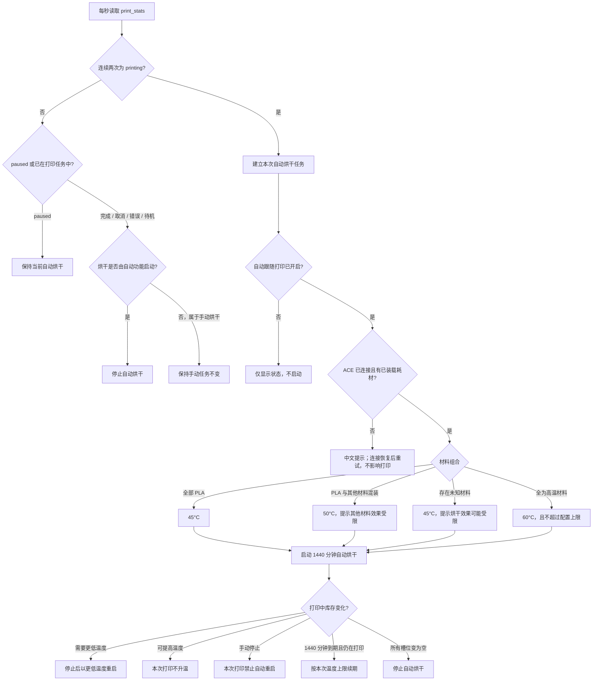

# 自动跟随打印烘干流程

本流程由 ACEPROSV08 Klipper 驱动每秒读取 `print_stats` 执行，不依赖 Fluidd 页面保持打开，也不依赖切片器开始或结束宏。

## 温度优先级

1. 存在未知材料：`45°C`。
2. PLA 与其他已识别材料混装：`50°C`。
3. 全部为 PLA：`45°C`。
4. 全部为 ABS、ABSCF、PETG、PAHTCF、PETCF 或 PEEK：`60°C`。
5. 所有槽位为空：不启动烘干。

自动功能只停止自己启动的烘干。打印前手动开启的烘干不会被接管；打印中手动停止自动烘干后，本次打印不会再次自动启动。

启动、停止或 USB 断联造成的未确认请求使用 30 秒退避，同一任务最多尝试三次。打印结束时若启动请求仍在等待响应，驱动会记录“必须停止”；启动响应稍后成功时会立即发送停止命令。停止失败前不会提前清除自动任务所有权。
