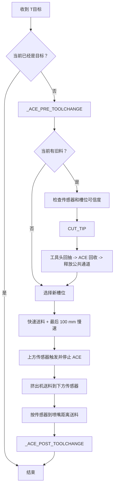

# Ace Pro Control Center 驱动 v1.2.0 功能与调校说明

本文解释 v1.2.0 驱动的配置结构、耗材路径、换料状态机、自动探测、烘干策略、断联恢复和安全调校方法。安装操作见 [完整安装与恢复教程](INSTALL.zh-CN.md)。

本驱动从 `szkrisz/ACEPROSV08` 衍生，当前只支持一台 ACE Pro 和 T0-T3 四槽。不能与 `Kobra-S1/ACEPRO` 或原版 `szkrisz/ACEPROSV08` 同时加载。

## 1. 名称与兼容标识

| 类型 | 值 |
| --- | --- |
| 项目英文展示名 | Ace Pro Control Center |
| 项目中文展示名 | ACE Pro 管理中心 |
| 设备名 | ACE Pro |
| 当前驱动身份 | `ACE_PRO_CONTROL_CENTER` |
| 兼容读取的旧身份 | `ACEPROSV08` |
| 版本 | `1.2.0` |
| 配置节 | `[ace]` |
| 命令前缀 | `ACE_*` |

项目更名不改变切片文件中的 T0-T3、`[ace]` 配置、`ACE_*` 命令和现有客户端路径。

## 2. 耗材路径和两个关键事实

```text
送料：ACE T0-T3 -> 五通 -> 五通传感器（可选） -> 上方传感器 -> 挤出机 -> 下方传感器 -> 喷嘴
回收：喷嘴 <- 下方传感器 <- 挤出机 <- 上方传感器 <- 五通传感器（可选） <- 五通 <- ACE
```

1. **上方传感器触发只表示料已到达挤出机入口。** 驱动随后必须联动挤出机继续向下送料。
2. **下方传感器触发才表示耗材已经穿过挤出机。** 驱动随后按 `toolhead_sensor_to_nozzle` 继续送到喷嘴。

普通 T0-T3 始终送入喷嘴。`ACE_PRELOAD` 是独立的冷态维护功能，只送到下方传感器。

## 3. 安装后必须实测的参数

模板顶部用说明标出以下项目。没有跨 DIY 机器通用的安全值。

| 参数 | 当前模板值 | 必须如何填写 |
| --- | ---: | --- |
| `serial` | `/dev/serial/by-id/usb-ANYCUBIC_ACE_1-if00` | 用 `ls -l /dev/serial/by-id/` 核对实际 ACE 稳定路径 |
| `extruder_sensor_pin` | 留空 | 上方传感器实际 Klipper MCU 引脚 |
| `toolhead_sensor_pin` | 留空 | 下方传感器实际 Klipper MCU 引脚 |
| `toolchange_load_length` | 1200 mm | ACE 停放位置到上方传感器的最大送料距离，并留合理打滑余量 |
| `toolchange_retract_length` | 1200 mm | 足以把旧料退回 ACE 并释放公共通道的总回抽距离 |
| `bowden_tube_length` | 190 mm | ACE 出料口到五通进料口的实际 PTFE 长度 |
| `toolhead_sensor_to_nozzle` | 80 mm | 下方传感器到喷嘴的实际耗材路径长度 |
| `parking_sensor_pin` | 注释 | 只有安装五通传感器时填写本机引脚 |
| `parking_sensor_clear_move_length` | 75 mm | 五通传感器解除后继续向 ACE 回抽的总距离，包含安全余量 |
| `CUT_TIP` | 整段注释 | 按本机切刀坐标、轴范围和机械结构实现 |

`bowden_tube_length` 只表示 **ACE 出料口到五通进料口**，不是 ACE 内部停放点到挤出机的总距离，也不是四条支路分别需要精密标定的长度。五通附近少量误差由上方传感器闭环修正。

测量原则：使用真实耗材路径，不按外部直线距离；只留合理安全余量，不用过大长度掩盖齿轮打滑或传感器错误。

## 4. 配置分区

发布 `ace.cfg` 采用单文件分区：

1. 必填实测参数和路径示意。
2. `[ace]` 串口、送料、回料、传感器、恢复和功能开关。
3. 材料名称、烘干温度和喷嘴参考温度。
4. 默认注释的 `CUT_TIP` 示例。
5. 默认工具切换钩子。
6. `TR`、`T0`、`T1`、`T2`、`T3` 宏。

`ace.cfg` 运行文件应位于 `~/printer_data/config/ace.cfg`，并且是普通可写文件，不应是指向配置目录外部的软链接。

安装边界需要同时注意：安装器必须由普通 Klipper 用户运行，禁止 `sudo`/root；已有 `ace.cfg` 的保留模式不会合并本次向导答案，安装后仍要手动编辑运行配置。卡片范围会整体替换 `~/fluidd`，只保留 `config.json`，旧主题或插件只能从安装前 `old/fluidd/` 归档选择性恢复。驱动安装可能加入 `pyserial==3.5`，该 Python 环境依赖不在文件回滚范围。

## 5. 串口与调试参数

| 参数 | 默认值 | 作用与调校 |
| --- | ---: | --- |
| `serial` | 固定 by-id 路径 | 优先保持稳定路径；只有 `auto` 或 `detect` 才扫描设备 |
| `baud` | 115200 | ACE Pro 常用波特率，除非硬件协议明确不同，否则不改 |
| `enable_debug_rpc` | `False` | 原始 RPC 调试开关；普通使用必须关闭 |
| `ace_request_timeout` | 5 s | 单个 ACE 请求的响应等待，不等于整段机械动作必然完成 |
| `ace_ready_timeout` | 15 s | 普通请求后等待 ACE 恢复 `ready` 的基础上限 |
| `ace_stop_ready_timeout` | 25 s | 停止送料后最短等待；驱动还按距离/速度动态延长 |

USB 断联优先检查 by-id 路径、数据线、插口、供电和内核日志，不要只增加超时。

## 6. 连续送料参数

| 参数 | 默认值 | 作用 |
| --- | ---: | --- |
| `feed_speed` | 80 mm/s | 手动 `ACE_FEED` 未提供速度时的默认值 |
| `feed_fast_speed` | 160 mm/s | 自动换料的大段快速送料速度 |
| `feed_approach_speed` | 25 mm/s | 接近上方传感器时的慢速 |
| `feed_approach_length` | 100 mm | 总路程最后 100 mm 切换慢速 |
| `intermittent_feed` | `False` | `False` 连续请求；`True` 兼容分段模式 |
| `feed_fast_chunk_length` | 1000 mm | 只在断续模式中限制快速段单次长度 |
| `feed_slip_compensation_length` | 400 mm | 主送料结束未触发上方传感器时，允许的一次最大补偿 |
| `feed_slip_compensation_chunk` | 50 mm | 只在断续模式中限制补偿单次长度 |
| `feed_slip_compensation_speed` | 25 mm/s | 打滑补偿低速 |
| `ace_motion_chunk_length` | 100 mm | 慢速/兼容分段动作默认分段；主送料连续模式不使用 |

### 6.1 连续模式流程


取消固定 100 mm 停顿不等于取消传感器检测。驱动仍轮询上方传感器并在触发后请求停止。

### 6.2 调速顺序

1. 先以当前管路和稳定材料确认不会打滑。
2. 只提高 `feed_fast_speed`，不要同时提高接近速度。
3. 保持最后 100 mm 慢速，观察上方传感器是否可靠停止。
4. 若主长度不足，先实测 `toolchange_load_length`，再评估补偿；不要直接无限增加 `feed_slip_compensation_length`。
5. 出现 ACE 断联、齿轮尖叫、料盘不能转动或 PTFE 抖动时立即降低快速速度。

## 7. 两阶段回料参数

| 参数 | 默认值 | 作用 |
| --- | ---: | --- |
| `retract_speed` | 80 mm/s | 手动 `ACE_RETRACT` 默认速度 |
| `retract_fast_speed` | 120 mm/s | 自动换料大段快速回抽 |
| `retract_parking_speed` | 25 mm/s | 接近停放位置的慢速 |
| `retract_parking_length` | 200 mm | 总回抽最后 200 mm 使用慢速 |
| `intermittent_retract` | `False` | `False` 两段连续请求；`True` 固定长度分段 |
| `toolchange_retract_length` | 1200 mm | 完整换料总回抽距离 |

默认模式只发送一次快速段和一次慢速停放段，不按 100 mm 反复停顿。

调校原则：

- 快速段提高效率，慢速段避免料盘惯性、入口磨损和停放过冲。
- 回抽仍断续时，确认实际加载的是 v1.2.0 驱动，并检查 `intermittent_retract: False`。
- 料盘无法跟随、齿轮打滑或耗材被拉细时，降低 `retract_fast_speed`。
- 旧料没有释放公共通道时，先核对切刀和真实耗材位置，再修正 `toolchange_retract_length`。

## 8. 工具头送料参数

| 参数 | 默认值 | 作用 |
| --- | ---: | --- |
| `toolhead_feed_fast_speed` | 8 mm/s | 上方触发后挤出机快速送料速度 |
| `toolhead_feed_slow_speed` | 5 mm/s | 慢速寻找下方传感器 |
| `toolhead_feed_fast_length` | 10 mm | 先快速送入挤出齿轮的总距离 |
| `toolhead_feed_fast_step` | 5 mm | 快速阶段每步距离 |
| `toolhead_feed_slow_step` | 1 mm | 慢速阶段每步距离 |
| `toolhead_sensor_max_feed_length` | 200 mm | 下方传感器未触发时允许的最大工具头送料 |
| `toolhead_to_nozzle_speed` | 5 mm/s | 下方触发后到喷嘴的速度 |
| `toolhead_sensor_to_nozzle` | 80 mm | 下方传感器到喷嘴的距离 |
| `extruder_sensor_timeout` | 15 s | 传感器相关等待上限 |

上方触发后下方不触发时，检查挤出齿轮是否真正转动、耗材是否进入齿轮、下方传感器方向和最大送料上限。不要把 `toolhead_sensor_max_feed_length` 无限制调大。

## 9. 五通传感器与自动探测参数

| 参数 | 默认值 | 作用 |
| --- | ---: | --- |
| `parking_sensor_pin` | 未配置 | 五通传感器实际 MCU 引脚；没有硬件时保持注释 |
| `parking_sensor_position` | `after_five_way` | `after_five_way` 或 `before_five_way` |
| `parking_sensor_clear_move_length` | 75 mm | 传感器解除后继续向 ACE 回抽的总距离 |
| `parking_sensor_debounce_count` | 3 | 连续目标状态次数，降低微动抖动误停 |
| `five_way_parking_margin` | 20 mm | 只用于无五通传感器的兼容估算路径 |
| `calibration_max_retract_length` | 1500 mm | 搜索五通传感器解除状态的回抽上限 |
| `calibration_feed_speed` | 160 mm/s | 自动探测送料速度，触发上方传感器后立即请求停止 |
| `calibration_retract_speed` | 120 mm/s | 自动探测回抽速度 |
| `calibration_chunk_length` | 100 mm | 粗测分段，结果允许约一个分段范围的误差 |
| `calibration_final_chunk_length` | 100 mm | 接近估算停放点时的末段长度，不再追求毫米级精测 |

`parking_sensor_clear_move_length` 已包含用户希望保留的距离和安全余量，不再叠加 `five_way_parking_margin`。

旧配置中的 `calibration_speed` 仍可读取，并在未填写两个独立速度时同时作为送料和回抽速度。新配置应优先使用独立速度。粗测分段的目的是减少频繁启停、ACE 就绪等待，以及料盘转动和耗材弹性对小步测量的放大；默认精度目标约为 `±100 mm`，不适合当作毫米级机械标定值。

## 10. 自动探测料管长度

### 10.1 开始条件

- `print_stats` 为待机，不是打印或暂停。
- ACE 已连接并处于就绪状态。
- 没有其他送料、回料或换料占用动作锁。
- 上下传感器必须均无料。
- 目标槽位有料，路径畅通。

### 10.2 一键探测

```text
ACE_CALIBRATE INDEX=n CONFIRM=1
```

执行顺序：

1. 受限送料到上方传感器。
2. 有五通传感器时，确认其检测到料，再受限回抽到稳定解除。
3. 继续回抽 `parking_sensor_clear_move_length` 完成清道。
4. 无五通传感器时，使用送料上界、`bowden_tube_length` 和安全余量估算内部停放点。
5. 生成内存预览，不自动保存。

有五通传感器时显示：

- 上方传感器到五通传感器距离。
- 上方传感器到五通停放点距离。
- ACE 出料口到五通进料口的配置长度。

无五通传感器时显示上方传感器到内部停放点距离。

### 10.3 保存和取消

确认耗材已经回到安全位置且上下传感器无料：

```text
ACE_CALIBRATION_SAVE CONFIRM=1
```

取消未保存结果：

```text
ACE_CALIBRATION_CANCEL
```

高级诊断拆分命令：

```text
ACE_CALIBRATE_FEED INDEX=n CONFIRM=1
ACE_CALIBRATE_RETRACT CONFIRM=1
```

### 10.4 结果有效性

以下变化会使保存结果过期：

- `bowden_tube_length`
- `five_way_parking_margin`
- 是否启用五通传感器
- `parking_sensor_position`
- `parking_sensor_clear_move_length`
- 标定格式版本

结果过期、失败或槽位位置未知时，普通 T0-T3 退回完整传感器保护路径，不依赖预停放估算。

## 11. 冷态预装载和完全卸载

```text
ACE_PRELOAD INDEX=n CONFIRM=1
ACE_FULL_UNLOAD INDEX=n CONFIRM=1
ACE_ABORT_TOOLCHANGE
```

`ACE_PRELOAD`：

- 开始前检查待机、连接、动作锁、槽位和传感器状态。
- 不加热、不归零、不移动 XY/Z、不执行切刀。
- 上方传感器触发后通过受限 `FORCE_MOVE` 联动挤出机。
- 下方传感器触发后停止，不执行到喷嘴的追加距离。
- 需要全局 `[force_move] enable_force_move: True`。

`ACE_FULL_UNLOAD` 把指定槽位完整退回 ACE。失败或断联时位置标记为 `unknown`。

`ACE_ABORT_TOOLCHANGE` 用于终止当前内存动作/恢复状态。它会尝试停止当前 ACE 送料或回抽，但不会把不确定位置伪装为安全状态；再次换料前必须检查传感器。

位置状态 `preload_parked_estimated` 表示耗材停在五通支路附近的估算预停放位置，不代表毫米级绝对位置。普通 T0-T3 仍以实时上、下传感器完成到喷嘴的闭环装载。

## 12. 正常工具切换状态机



控制台输出 `TA -> TB`、当前阶段和失败位置。切刀、传感器或回抽异常时打印任务优先暂停，不直接取消。

## 13. 切刀宏边界

默认配置不启用 `CUT_TIP`，因为以下内容无法跨机器复用：

- 切刀位于左后、左前或其他位置。
- X/Y 轴范围和安全速度。
- 是否必须归零。
- 是否需要抬 Z 或避让打印件。
- 切断后的挤出机回抽距离。
- 完成后是否回到原位置。

只有用户完成空载验证后才可启用。默认 `_ACE_PRE_TOOLCHANGE`、`_ACE_POST_TOOLCHANGE` 只输出中文提示。

## 14. 断联恢复参数

| 参数 | 默认值 | 作用 |
| --- | ---: | --- |
| `ace_reconnect_timeout` | 30 s | 等待 ACE 重新连接的最长时间 |
| `ace_reconnect_stable_time` | 3 s | 重连后稳定多久才允许协调 |
| `ace_resume_max_retries` | 1 | 单次底层动作断联恢复重试上限 |
| `auto_toolchange_recovery` | `True` | 启用换料传感器协调恢复 |
| `auto_toolchange_recovery_max_retries` | 3 | 换料自动协调最大次数 |
| `auto_resume_after_ace_reconnect` | `True` | 成功恢复后自动继续驱动拥有的暂停 |

恢复原则：

1. 不直接重放结果不确定的物理命令。
2. 先停止后续分段并记录失败阶段。
3. 重连稳定后读取实时上下传感器和动作上下文。
4. 只做边界内、有限次数的协调。
5. 只有恢复成功且暂停由驱动创建时才自动 `RESUME`。
6. 切刀、工具头回抽或停放回抽无法确认时保持暂停，不自动重演。

这兼顾无人值守打印与防止重复送料/回抽，但不能解决物理堵料、传感器故障或 USB 供电问题。

## 15. 无限续料

| 参数 | 默认值 | 作用 |
| --- | ---: | --- |
| `endless_spool` | `False` | 初始无限续料开关 |
| `endless_spool_require_same_material` | `True` | 备用槽必须使用相同材料名称 |
| `runout_debounce_count` | 3 | 打印中连续无料确认次数，约 150 ms |

- 只有 `print_stats=printing` 时累计断料。
- 待机、暂停和维护动作期间清零。
- 没有同材备用槽或状态不可信时暂停打印。
- 成功切换后同步槽位、当前工具和位置状态。

## 16. 材料资料

每种材料由三个连续参数组成：

```ini
material_1_name: PLA
material_1_drying_temperature: 45
material_1_temperature: 210
```

| 后缀 | 含义 |
| --- | --- |
| `_name` | Fluidd/备用页显示名、无限续料匹配名、自动烘干匹配名 |
| `_drying_temperature` | ACE Pro 烘干目标温度 |
| `_temperature` | 喷嘴参考温度，不直接控制烘干 |

默认资料：

| 材料 | 烘干 | 喷嘴参考 |
| --- | ---: | ---: |
| PLA | 45°C | 210°C |
| ABS | 60°C | 260°C |
| PETG | 60°C | 250°C |
| ABSCF | 60°C | 260°C |
| PAHTCF | 60°C | 270°C |
| PETCF | 60°C | 270°C |
| PEEK | 60°C | 360°C |

其他策略参数：

| 参数 | 默认值 | 作用 |
| --- | ---: | --- |
| `unknown_material_drying_temperature` | 45°C | 未匹配材料的烘干温度 |
| `unknown_material_temperature` | 0 | 未知喷嘴参考温度 |
| `mixed_material_drying_temperature` | 50°C | PLA 与其他材料混装温度 |
| `show_material_warning` | `True` | 显示混装/未知材料限制提示 |
| `max_dryer_temperature` | 65°C | ACE 烘干硬上限 |

## 17. 自动跟随打印烘干

### 17.1 材料温度规则

| 已装载材料 | 自动温度 |
| --- | ---: |
| 全部 PLA | 45°C |
| PLA 与其他材料混装 | 50°C，并提示其他材料烘干受限 |
| 存在未知材料 | 45°C，并提示烘干受限 |
| 全部为 ABS、ABSCF、PETG、PAHTCF、PETCF、PEEK | 60°C |
| 所有槽位为空 | 不启动；自动任务运行中则停止 |

最终温度取材料策略与 `max_dryer_temperature` 中较小值。

### 17.2 生命周期

- 连续两次读取 `print_stats.state=printing` 后建立自动任务。
- `paused` 保持自动烘干。
- `complete`、`cancelled`、`error`、`standby` 停止驱动自动拥有的任务。
- 打印中材料变化可自动降温，不自动升温。
- 1440 分钟任务结束而打印仍继续时，按当前温度续期。
- 打印中手动停止后，本次打印不再自动启动。
- 手动启动的任务不会被自动功能接管或停止。

### 17.3 断联和失败

- 烘干启动/停止失败不会暂停或取消打印。
- 请求失败后等待 30 秒再重试，最多三次。
- USB 断联产生的待处理请求会被清理，不永久卡住状态机。
- 打印结束时若启动响应仍在途，响应成功后立即补发停止。
- 停止失败时保留自动任务所有权，避免错误显示已停止。

控制命令：

```text
ACE_ENABLE_AUTO_DRYING
ACE_DISABLE_AUTO_DRYING
ACE_START_DRYING TEMP=60 DURATION=120
ACE_STOP_DRYING
```

## 18. 库存和状态命令

常用只读/库存命令：

```text
ACE_QUERY_SLOTS
ACE_GET_CURRENT_INDEX
ACE_TEST_RUNOUT_SENSOR
ACE_TOOLCHANGE_STATUS
ACE_SAVE_INVENTORY
```

设置槽位：

```text
ACE_SET_SLOT INDEX=0 MATERIAL=PLA COLOR=0,251,255 TEMP=210
ACE_SET_SLOT INDEX=0 EMPTY=1
```

换卷会执行物理回抽：

```text
ACE_CHANGE_SPOOL INDEX=0 CONFIRM=1
```

打印或暂停期间禁止换卷。当前槽位已经装载时，驱动先完整卸载，再处理料卷，不执行第二次重复回抽。

## 19. 手动动作命令

```text
ACE_FEED INDEX=0 LENGTH=20 SPEED=10 CONFIRM=1
ACE_RETRACT INDEX=0 LENGTH=20 SPEED=10 CONFIRM=1
ACE_ENABLE_FEED_ASSIST INDEX=0
ACE_DISABLE_FEED_ASSIST INDEX=0
```

手动送料/回料要求 `CONFIRM=1`，打印或暂停期间禁止。Fluidd/Moonraker 对 UI 请求进一步限制距离 1-500 mm、速度 1-120 mm/s。

不要使用手动动作修正未知槽位身份；先核对传感器和真实耗材位置。

## 20. 保存状态和升级迁移

驱动通过 `[save_variables]` 保存：

- 四槽库存。
- 当前槽位。
- 四槽位置状态。
- 无限续料开关。
- 自动跟随烘干开关。
- 自动探测记录。

旧版位置状态升级时只迁移当前唯一能确认的槽位，其他槽位标记为 `unknown`，防止错误继承。Klipper 重启不会从保存状态重放机械动作。

不要手工伪造保存变量来掩盖实际耗材位置；位置冲突应通过检查传感器、完整卸载或重新探测处理。

## 21. 推荐调校顺序

1. 验证 ACE 固定串口和连接稳定性。
2. 手动按压验证上、下、可选五通传感器方向。
3. 用较小距离、较低速度验证四槽送料/回料方向。
4. 实测并填写所有管路长度。
5. 保持切刀禁用，先验证送料到上方和挤出机到下方。
6. 空载验证用户编写的 `CUT_TIP`。
7. 执行自动探测并检查回料位置，再保存。
8. 执行冷态预装载和完整卸载。
9. 执行完整 T0 -> T1 换料。
10. 最后在测试打印中验证 T 命令、断料暂停和自动烘干。

一次只改变一类参数，并记录修改前值、症状和结果。

## 22. 故障定位速查

| 症状 | 优先检查 |
| --- | --- |
| 上方始终不触发 | 引脚/反相、传感器位置、五通堵塞、打滑、`toolchange_load_length` |
| 上方触发但下方不触发 | 挤出机是否转动、齿轮夹持、下方引脚、`toolhead_sensor_max_feed_length` |
| 固定距离停顿 | `intermittent_feed`、`intermittent_retract`、实际驱动版本 |
| 停止送料后超时 | ACE 是否真的停止、动态等待、USB、`ace_stop_ready_timeout` |
| 旧料不切断 | `CUT_TIP` 是否启用、传感器/槽位状态是否可信 |
| 旧料不退出五通 | 切刀结果、`toolchange_retract_length`、五通传感器和物理堵塞 |
| 工具头移动到错误位置 | 用户宏中的 G28/G1 坐标，不是 ACE 默认空钩子 |
| 重连后保持暂停 | 不确定切刀/回抽、传感器冲突、超过恢复重试上限 |
| 探测结果过期 | Bowden、五通模式、停放距离或格式发生变化 |
| 烘干温度不符 | 材料名称、混装规则、未知材料、`max_dryer_temperature` |

## 23. 安全边界

- 不把增加距离作为传感器故障的第一修复手段。
- 不把增加超时作为 USB 断联的第一修复手段。
- 不在打印或暂停状态运行手动移动、探测、预装载或完全卸载。
- 不在不知道真实耗材位置时连续执行 T 命令。
- 不启用未经本机空载验证的 `CUT_TIP`。
- 不同时加载其他 ACE 驱动。
- 不开启 `enable_debug_rpc` 作为日常控制方式。
- 不删除安装归档，直到升级和真机动作验证完成。

## 24. 已验证范围与剩余风险

v1.2.0 已进行驱动、Moonraker、备用页、Fluidd 和安装器自动测试；Fluidd 完整构建基线为 v1.37.2。自动测试不能替代真实切刀坐标、传感器电平、管路长度、料盘惯性、USB 供电和耗材打滑验证。

安装器的归档和混合安装顺序已在 Git Bash 自动测试，原生 Linux 真实软链接类型/目标恢复仍应在不同发行版与安装布局中继续验证。安装和升级后请保留 `~/.local/share/ace-pro-control-center/old/`。
