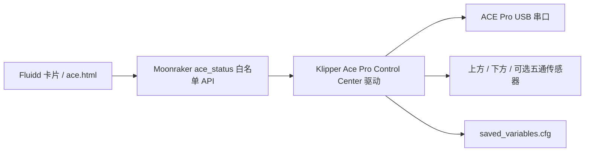
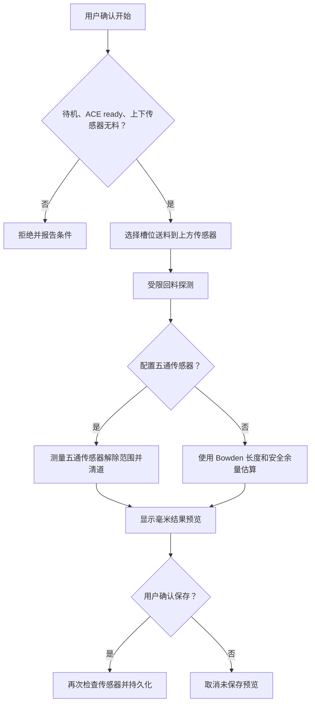

# ACE Pro 管理中心功能与接口总览

## 1. 产品定位

Ace Pro Control Center（ACE Pro 管理中心）是从 `szkrisz/ACEPROSV08` 衍生的独立 GPL-3.0 项目，用于在 DIY Klipper 打印机上管理一台 ACE Pro 和 T0-T3 四个料槽。

主界面是 Fluidd 原生导航页和仪表盘卡片。`/ace.html` 是功能对应的备用控制与诊断页，不是替代 Fluidd 的新网站。

项目展示名与运行时兼容标识分开：

| 类型 | 固定值 |
| --- | --- |
| 英文展示名 | Ace Pro Control Center |
| 中文展示名 | ACE Pro 管理中心 |
| 设备名 | ACE Pro |
| 驱动身份 | `ACE_PRO_CONTROL_CENTER` |
| G-code 前缀 | `ACE_*` |
| 配置节 | `[ace]` |
| API 前缀 | `/server/ace/*` |
| 安装路径 | `ace-pro-control-center` |

## 2. 系统结构



| 层 | 主要文件 | 职责 |
| --- | --- | --- |
| Klipper 驱动 | `extras/ace.py`、`ace.cfg` | 串口、库存、传感器、送料、回料、换料、烘干、探测和持久状态 |
| Moonraker | `ace_status_integration/moonraker/ace_status.py` | 状态归一化、能力发现、参数校验和固定命令白名单 |
| Fluidd | `fluidd-source-overlay/`、`fluidd-dist/` | 原生导航页、仪表盘卡片、确认弹窗和中文状态 |
| 备用页面 | `ace_status_integration/web/` | 与卡片同能力的备用控制和诊断入口 |
| 安装器 | `install.sh`、`ui-installer.sh`、`uninstall.sh` | 校验、归档、安装、升级、回滚、卸载和状态检查 |

前端不能提交任意 G-code。即使 API 404、网络错误、409 或服务端 5xx，卡片和备用页也只显示失败，不会退回直接发送原始 `ACE_*` 命令。

## 3. Fluidd 卡片与备用页面

两个界面提供相同的产品能力，区别仅限空间和布局：

- ACE Pro 连接、忙碌、温度、风扇、当前工具和错误摘要。
- 上方传感器、下方传感器和可选五通传感器开关状态。
- 横向四槽料卷：槽位状态、颜色、材料、喷嘴参考温度和已知位置。
- 装载、卸载、换卷、设为空、编辑并保存库存。
- 手动送料和回料的槽位、距离、速度与确认。
- 送料辅助、无限续料和自动跟随烘干开关。
- 手动烘干目标温度、时长、当前状态和剩余时间。
- 自动探测料管长度、保存/取消结果、冷态预装载和完整卸载。
- 换料阶段、断联恢复、标定有效性、最近错误和诊断信息。

卡片中的次要维护功能可折叠到“更多功能”；独立 `/ace.html` 保持完整展开，避免备用诊断时隐藏操作。

## 4. 设备与四槽库存

- 固定一台 ACE Pro、四槽 T0-T3。
- 显示 ACE 硬件返回的槽位状态和软件库存资料。
- 每槽保存 `status`、RGB 颜色、材料名称和喷嘴参考温度。
- RGB 必须是三个 0-255 整数；无效输入不会写入。
- 库存保存到 Klipper `SAVE_VARIABLE`，刷新后从统一状态恢复。
- “设为空”清除当前槽位材料资料。
- “换卷”会执行物理回抽，必须弹窗确认并携带 `CONFIRM=1`。
- 打印或暂停期间禁止从 UI 换卷，避免破坏正在使用的耗材路径。

槽位位置状态：

| 状态 | 含义 |
| --- | --- |
| `internal_or_unknown` | 位于 ACE 内部或位置尚不精确 |
| `preload_parked_estimated` | 位于五通支路附近的估算预停放位置 |
| `upper_sensor` | 已到达挤出机上方传感器 |
| `toolhead` | 已进入挤出机/工具头路径 |
| `nozzle` | 已完成到喷嘴装载 |
| `unknown` | 发生断联、冲突或无法证明位置 |

物理传感器优先于保存状态。传感器与槽位记录冲突时，驱动停止动作并报告，不猜测哪一槽在喷嘴里。

## 5. 双传感器与耗材路径

```text
ACE T0-T3 -> 五通 -> 五通传感器（可选） -> 上方传感器 -> 挤出机 -> 下方传感器 -> 喷嘴
```

- 上方传感器触发：耗材到达挤出机入口，不代表已经进入挤出齿轮或喷嘴。
- 上方触发后：驱动联动挤出机继续向下送料。
- 下方传感器触发：耗材已穿过挤出机，到达下方检测位置。
- 下方触发后：按 `toolhead_sensor_to_nozzle` 继续送到喷嘴。
- 可选五通传感器：用于检测公共通道和辅助回抽停放，不是所有机器的必需硬件。

传感器名称由驱动固定创建为 `extruder_sensor` 和 `toolhead_sensor`，Moonraker `[ace_status]` 默认读取这两个对象名。MCU 引脚仍由用户在 `ace.cfg` 中填写。

## 6. 送料、回料与换料

### 6.1 连续送料

- 默认 `intermittent_feed: False`。
- 快速阶段使用 `feed_fast_speed`。
- 最后 `feed_approach_length` 使用 `feed_approach_speed` 慢速接近上方传感器。
- 正常长度结束后仍未触发时，只允许一次最大 `feed_slip_compensation_length` 的低速打滑补偿。
- 上方传感器触发后立即请求停止，不继续盲送剩余距离。
- 停止后按请求距离/速度动态延长 `ready` 等待，避免把正常减速误判为超时。

### 6.2 两阶段回料

- 默认 `intermittent_retract: False`。
- 总回抽先使用 `retract_fast_speed`。
- 最后 `retract_parking_length` 使用 `retract_parking_speed` 慢速停放。
- 不再按固定 100 mm 反复停顿。
- 有五通传感器时可按传感器解除状态和清道距离停止。

### 6.3 兼容断续模式

- `intermittent_feed: True`：恢复分段送料，使用 `feed_fast_chunk_length`、`feed_slip_compensation_chunk` 和 `ace_motion_chunk_length`。
- `intermittent_retract: True`：恢复分段回抽。
- 仅在 ACE 固件或特定机械结构无法稳定处理长请求时使用。

### 6.4 正常换料

- `T0`、`T1`、`T2`、`T3` 宏调用 `ACE_CHANGE_TOOL TOOL=n`。
- `TR` 调用 `ACE_CHANGE_TOOL TOOL=-1`，表示卸载当前工具。
- 普通 T0-T3 始终送入喷嘴。
- 控制台以中文显示 `TA -> TB`、切刀、工具头回抽、Bowden 回收、上方传感器送料、下方传感器送料和完成/失败位置。
- 送料失败优先暂停打印，不取消打印任务。

切片文件中的 T0-T3 是正常多色打印路径。Moonraker 只禁止用户在 Fluidd 中于打印期间手动发起普通换料、移动和维护动作，不能理解为驱动禁止打印文件执行 T0-T3。

## 7. 切刀和换料宏

- `_ACE_PRE_TOOLCHANGE` 默认只显示“正在执行换色前准备”。
- `_ACE_POST_TOOLCHANGE` 默认只显示换色后处理和完成提示。
- `CUT_TIP` 发布模板保持注释。
- 用户必须按本机切刀位置、轴范围、归零策略和机械结构实现 `CUT_TIP`。
- 驱动只有在传感器与当前槽位状态足以证明需要卸载时才调用切刀和回抽。
- 状态矛盾时不会为了“继续流程”猜测并切刀。

## 8. 断联、暂停与恢复

- 状态包含连接状态、连接代次、最近断联原因和恢复要求。
- 使用用户配置的固定串口；只有 `serial: auto` 或 `serial: detect` 才扫描。
- 已发送但未确认结果的物理请求标记为 `uncertain`。
- 不确定请求不会直接重放，也不会继续后续分段。
- 换料过程中断联可暂停打印，重连稳定后根据实时传感器和有限重试协调。
- 只有驱动自己触发的暂停，且恢复成功，才允许自动 `RESUME`。
- 自动恢复超过 `auto_toolchange_recovery_max_retries` 后保持暂停并报告阶段。
- 切刀、工具头回抽或停放回抽结果无法确认时，不自动重演机械动作。
- Klipper 重启不会从保存变量重放送料、回抽、切刀或换料。
- `ACE_ABORT_TOOLCHANGE` 请求停止当前动作、终止内存恢复状态，并把无法确认的槽位标记为未知。

## 9. 自动探测料管长度

`ACE_CALIBRATE` 把送料和回料探测组合成一个用户操作：



功能边界：

- 开始前打印机必须待机、ACE `ready`、上下传感器必须均无料。
- 动作开始和保存结果分别确认。
- 有五通传感器时，根据传感器解除范围和 `parking_sensor_clear_move_length` 计算。
- 无五通传感器时，根据 `bowden_tube_length` 和兼容安全余量估算内部停放点。
- 显示“上方传感器到五通传感器/五通停放点”或“上方传感器到内部停放点”的毫米距离。
- 结果先留在内存预览，二次确认后才写入保存变量。
- 修改关键长度、五通模式、偏移或标定格式后旧结果自动过期。

受控命令：

```text
ACE_CALIBRATE INDEX=n CONFIRM=1
ACE_CALIBRATE_FEED INDEX=n CONFIRM=1
ACE_CALIBRATE_RETRACT CONFIRM=1
ACE_CALIBRATION_SAVE CONFIRM=1
ACE_CALIBRATION_CANCEL
```

## 10. 冷态预装载与完全卸载

```text
ACE_PRELOAD INDEX=n CONFIRM=1
ACE_FULL_UNLOAD INDEX=n CONFIRM=1
```

`ACE_PRELOAD`：

- 只允许待机维护。
- 不加热、不归零、不移动 XY/Z、不调用切刀。
- 送料到上方传感器后联动挤出机，直到下方传感器触发。
- 不追加下方传感器到喷嘴的距离。
- 需要 Klipper 全局 `[force_move] enable_force_move: True`。

`ACE_FULL_UNLOAD` 把指定槽位完整退回 ACE。任何无法确认的结果都会保留未知位置，不会伪装为已安全卸载。

## 11. 手动烘干和自动跟随打印

### 11.1 手动烘干

- 设置 1 到 `max_dryer_temperature` 的目标温度。
- 设置 1-1440 分钟时长。
- 显示当前温度、目标温度、运行状态和剩余时间。
- 手动启动的任务保持用户所有权，自动功能不会停止或接管。

### 11.2 自动跟随打印

| 材料组合 | 默认策略 |
| --- | --- |
| 全部 PLA | 45°C |
| PLA 与其他已知材料混装 | 50°C，并提示其他材料效果受限 |
| 存在未知材料 | 45°C，并提示效果受限 |
| ABS、ABSCF、PETG、PAHTCF、PETCF、PEEK | 60°C |
| 全部槽位为空 | 不启动；已运行则停止自动任务 |

- 最终目标不超过 `max_dryer_temperature`。
- 连续确认打印开始后启动自动任务。
- 暂停打印时保持烘干。
- 完成、取消、错误或待机后停止自动拥有的任务。
- 打印中材料变化允许降温，不自动升温。
- 打印中手动停止后，本次打印不再自动启动。
- ACE 断联或命令失败不暂停/取消打印；请求按 30 秒退避，最多三次。

## 12. 自定义材料资料

每个资料组包含：

```ini
material_N_name: MATERIAL
material_N_drying_temperature: 60
material_N_temperature: 250
```

- 材料名称用于 UI 下拉选项、自动烘干匹配和无限续料同材判断。
- 烘干温度用于 ACE Pro 烘干策略。
- 喷嘴参考温度只作为库存资料，不自动修改打印温度。
- 名称匹配不区分大小写。
- 默认包含 PLA、ABS、PETG、ABSCF、PAHTCF、PETCF 和 PEEK。
- 未知材料使用 `unknown_material_*`；PLA 混装使用 `mixed_material_drying_temperature`。

## 13. 无限续料与断料处理

- 无限续料开关持久保存。
- 只在 `print_stats.state=printing` 时累计断料消抖。
- 待机和暂停期间清零计数，避免维护操作误触发。
- 默认 `endless_spool_require_same_material: True`，只切换到名称相同的备用槽。
- 没有匹配槽、材料未知或状态冲突时暂停打印。
- 成功切换后同步当前工具、槽位库存和位置状态。

## 14. Moonraker API

| 方法 | 路径 | 作用 |
| --- | --- | --- |
| GET | `/server/ace/status` | 完整归一化状态 |
| GET | `/server/ace/slots` | 四槽库存和位置 |
| GET | `/server/ace/capabilities` | 驱动身份、能力和命令列表 |
| POST | `/server/ace/command` | 执行固定白名单命令 |

白名单命令：

| 类别 | 命令 |
| --- | --- |
| 库存 | `ACE_SET_SLOT`、`ACE_SAVE_INVENTORY`、`ACE_QUERY_SLOTS` |
| 换料 | `ACE_CHANGE_TOOL`、`ACE_CHANGE_SPOOL`、`ACE_GET_CURRENT_INDEX`、`ACE_ABORT_TOOLCHANGE` |
| 手动移动 | `ACE_FEED`、`ACE_RETRACT`、`ACE_ENABLE_FEED_ASSIST`、`ACE_DISABLE_FEED_ASSIST` |
| 烘干 | `ACE_START_DRYING`、`ACE_STOP_DRYING`、`ACE_ENABLE_AUTO_DRYING`、`ACE_DISABLE_AUTO_DRYING` |
| 无限续料 | `ACE_ENABLE_ENDLESS_SPOOL`、`ACE_DISABLE_ENDLESS_SPOOL` |
| 传感器 | `ACE_TEST_RUNOUT_SENSOR` |
| 探测 | `ACE_CALIBRATE`、`ACE_CALIBRATE_FEED`、`ACE_CALIBRATE_RETRACT`、`ACE_CALIBRATION_SAVE`、`ACE_CALIBRATION_CANCEL` |
| 维护 | `ACE_PRELOAD`、`ACE_FULL_UNLOAD` |

Moonraker 负责：

- 拒绝未知命令和未知参数。
- 校验槽位 0-3、RGB、距离、速度、温度和时长范围。
- 为手动移动、换卷、预装载、完整卸载和探测强制 `CONFIRM=1`。
- 在 API 侧阻止打印中的 UI 写操作。
- 不暴露任意 G-code 接口。

## 15. G-code 命令和打印边界

Klipper 驱动还注册诊断和内部命令。日常用户优先使用 Fluidd，不应通过外部客户端绕过 Moonraker 参数校验。

打印期间：

- 切片文件中的 T0-T3 正常工作。
- Fluidd 不允许用户手动发起普通换料、库存改写、送料、回料、预装载、完全卸载或探测。
- 停止烘干、关闭功能、只读查询和紧急终止仍可用。
- 换料故障优先暂停打印并保留恢复条件。

## 16. 安全配置默认值

- `enable_debug_rpc: False`，禁止普通环境原始 RPC 调试。
- `intermittent_feed: False`，默认连续送料。
- `intermittent_retract: False`，默认两阶段连续回料。
- `auto_toolchange_recovery: True`，只做传感器协调和有限重试。
- `auto_resume_after_ace_reconnect: True`，仅恢复驱动拥有的暂停。
- `endless_spool_require_same_material: True`。
- `_ACE_PRE_TOOLCHANGE`、`_ACE_POST_TOOLCHANGE` 不移动、不归零、不加热。
- `CUT_TIP` 默认注释。
- 五通传感器引脚默认不填写。
- 上下传感器引脚必须由用户填写。

## 17. 安装、升级与恢复

- 字符安装器支持中文和英文。
- 安装器只允许安装 Klipper 的普通用户运行，拒绝 root；不得使用 `sudo sh install.sh`。
- Git 源码建议放在 `~/ace-pro-control-center-source`。
- 运行文件默认部署到 `~/ace-pro-control-center`。
- 支持完整安装、仅驱动、仅卡片、强制安装、最近回滚、完整卸载、范围卸载和状态查询。
- 强制安装不跳过 `manifest.sha256`、安装前归档或失败恢复。
- 卡片安装整体替换 `~/fluidd`，只自动保留原 `config.json`；手工主题、插件和额外文件只保存在 `old/fluidd/` 归档中。
- 写入前归档到 `~/.local/share/ace-pro-control-center/old/`。
- 安装失败、中断、回滚失败和卸载失败均使用事务恢复。
- 首次全局基线支持先驱动、先卡片或混合更新顺序。
- 更新默认保留当前 `ace.cfg`；保留模式不合并本次向导答案，`--install-new-config` 才替换模板。
- `ace.cfg` 安装为 `printer_data/config` 内普通可写文件。
- 缺少 `serial` 模块时会向 Klipper Python 环境安装 `pyserial==3.5`；Python 包不在文件回滚/卸载范围。
- 直接 CLI 的安装、回滚和卸载会确认，只有前置 `--yes` 跳过确认。
- 非交互普通安装遇版本风险会失败；只有 `--install-force` 明确越过兼容性阻断。
- 安装器不自动重启服务，不执行物理动作。

完整操作见 [v1.2.0 安装、升级与恢复教程](INSTALL.zh-CN.md)。

## 18. 当前限制与风险

- 只支持一台 ACE Pro 和四槽。
- Fluidd v1.37.2 是完整构建验证基线；其他版本只有风险提示和回滚保护，不代表完整兼容。
- 原生 Linux 真实软链接类型/目标恢复仍需在更多系统布局中持续验证；不要删除安装器归档。
- 自动测试不能替代切刀坐标、传感器电平、管路长度、USB 稳定性和堵料检查。
- 自动恢复不能证明不确定切刀或回抽已经完成；达到安全边界后会保持暂停。
- 默认配置不能跨 DIY 机器通用，上下传感器、五通传感器、切刀和路径长度必须实测。

## 19. 上游来源

- [szkrisz/ACEPROSV08](https://github.com/szkrisz/ACEPROSV08)：驱动、串口协议、命令和配置结构基础，GPL-3.0。
- [Kobra-S1/ACEPRO](https://github.com/Kobra-S1/ACEPRO)：网页交互、中文流程和料卷样式参考，GPL-3.0。
- [fluidd-core/fluidd](https://github.com/fluidd-core/fluidd)：Fluidd 页面和构建体系，GPL-3.0。
- [Moonraker](https://github.com/Arksine/moonraker)：服务端接口基础，GPL-3.0。
- [Vue](https://github.com/vuejs/core)：备用页面运行时，MIT。

项目许可证和详细修改边界见根目录 `LICENSE` 与 `THIRD_PARTY_NOTICES.md`。
