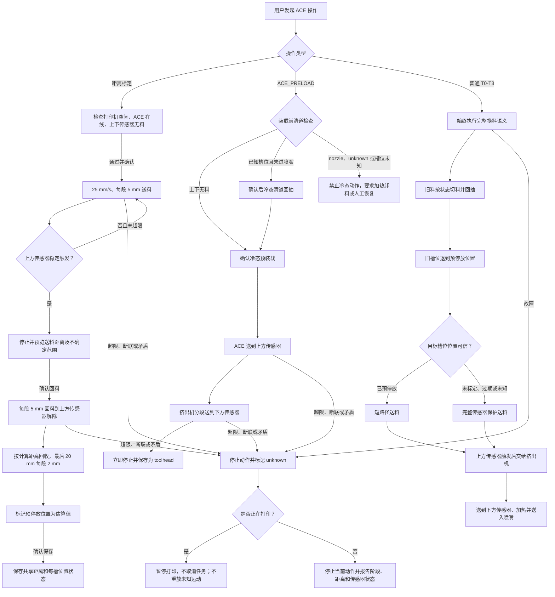

# ACEPROSV08 距离标定与五通预停放设计

日期：2026-07-27  
状态：用户已确认设计范围，等待书面规格复核

## 1. 目标

在单 ACE Pro 设备环境中增加共享的自动送料和回料距离标定，并让正常换料后的耗材停在五通各自支路内。下次装载从五通支路开始，缩短进入挤出机前的送料时间。

本功能同时修正空闲装载行为：打印机未打印时选择 T0-T3，默认只将耗材冷态送到挤出机下方传感器，不加热、不移动 XY/Z、不运行切刀，也不进入喷嘴。

## 2. 非目标与物理限制

- 不为 T0-T3 分别保存距离，四个槽位共用一套标定结果；每个槽位仍必须独立保存耗材位置状态。
- 不增加五通传感器或修改 ACE 固件。
- 不声称能够直接检测 ACE 内部停放点。现有 USB 协议不返回编码器位置、实际移动距离或内部停放点信号。
- 五通预停放位置是基于标定和管长计算的安全近似值；上方传感器仍是装载到位的最终闭环条件。
- 不在自动验证中执行 T0-T3、切刀、送料、回料或标定等物理动作。

## 3. 路径和距离定义

```text
[ACE 内部位置]
      |
[ACE 出料口]
      |  bowden_tube_length（用户测量，当前机器约 190 mm）
[五通进料口 / 各自支路安全停放区域]
      |
[五通公共通道]
      |
[挤出机上方传感器]
      |
[挤出机齿轮]
      |
[挤出机下方传感器]
      |
[喷嘴]
```

参数含义：

- `bowden_tube_length`：ACE 出料口到五通进料口的实际 PTFE 管路长度，不包含 ACE 内部距离和五通到上方传感器的距离。
- `toolchange_load_length`：标定和完整装载允许的绝对最大安全行程，不再作为每次固定盲送距离。
- `feed_approach_length`：正常送料最后的慢速接近区，固定为默认 100 mm，可配置。
- `five_way_parking_margin`：将耗材尖端进一步退入五通独立支路的安全余量，默认 20 mm。
- `calibration_speed`：首次送料和回料标定速度，默认 25 mm/s。
- `calibration_chunk_length`：标定时的常规分段长度，默认 5 mm。
- `calibration_final_chunk_length`：回料标定最后 20 mm 的精细分段长度，默认 2 mm。

预停放回抽距离采用共享近似值：

```text
parking_retract_distance =
    calibrated_feed_distance - bowden_tube_length + five_way_parking_margin
```

公式没有包含无法从 ACE 协议获得的“内部停放点到出料口”距离，因此不能证明耗材尖端准确位于五通。该结果只表示耗材已经从公共通道向 ACE 方向回收，并保留约 `bowden_tube_length - five_way_parking_margin` 的预送距离。持久状态使用 `preload_parked_estimated`，不得显示为传感器确认的五通位置。

结果必须限制在：

```text
0 < parking_retract_distance
parking_retract_distance <= toolchange_load_length + feed_slip_compensation_length
```

`feed_slip_compensation_length` 复用现有有限打滑补偿上限，不增加含义重复的配置项。超出范围时标定失败，不保存结果。

## 4. 持久状态

`saved_variables.cfg` 保存：

- 送料标定原始距离；
- 上方传感器解除所需的回料距离；
- 计算后的五通停放回抽距离；
- 标定时的 `bowden_tube_length` 和 `five_way_parking_margin`；
- 标定槽位、时间、格式版本和有效状态；
- 四个槽位各自的位置状态数组 `ace_slot_positions`。

标定原始值与包含安全余量的执行值分开保存。修改 `bowden_tube_length`、安全余量或标定格式版本后，旧结果标记为过期，不静默沿用。标定失败不覆盖上一次有效结果。

每个槽位使用以下明确状态：

- `internal_or_unknown`
- `preload_parked_estimated`
- `upper_sensor`
- `toolhead`
- `nozzle`
- `unknown`

`ace_current_index` 只表示当前进入公共通道或工具头的槽位，不能代替四槽位置数组。正常换料后，旧槽位可为 `preload_parked_estimated`，新槽位可为 `nozzle`，其他槽位保留各自状态。

旧版全局 `spliter` 和 `bowden` 状态在启动时迁移。只有当前槽位和传感器组合能够唯一确认时才迁移到明确状态；其他槽位统一转换为 `unknown`。传感器无法识别五通支路属于哪个槽位，因此不得使用传感器猜测槽位身份。

## 5. 标定状态机

### 5.1 启动条件

- `print_stats` 必须为 `standby`、`complete`、`cancelled` 或 `error`；`printing` 和 `paused` 均禁止标定。
- ACE 必须在线且为 ready。
- 上下传感器必须均无料。
- 用户选择一个状态为有料的槽位。
- 标定、换料、无限续料和手动运动共用互斥锁。

### 5.2 送料标定

1. 显示槽位、速度、最大距离和停止条件。
2. 用户二次确认。
3. 以 25 mm/s 按 `calibration_chunk_length` 标定段送料，每段前后监测带消抖的上方传感器。
4. 上方传感器稳定触发后立即停止，不再发送下一段运动。
5. 保存“已完成分段距离”和“最后一段 0 至 `calibration_chunk_length` 不确定范围”到临时会话。保守执行值使用该范围上界，不将一次连续请求的完整长度误认为实际触发距离。
6. 达到最大安全距离仍未触发时停止、报错并保持旧标定不变。

### 5.3 回料标定

1. 送料标定成功后显示回料动作预览。
2. 用户再次确认。
3. 以 `calibration_chunk_length` 分段低速回料并监测上方传感器稳定解除，记录已完成距离和最后一段不确定范围。
4. 按计算后的剩余距离继续向 ACE 方向回收；最后 20 mm 使用 `calibration_final_chunk_length` 分段，以限制停止误差。
5. 确认上下传感器均无料，将所选槽位临时标记为 `preload_parked_estimated`。
6. 显示送料距离、传感器解除距离、总回料距离、管长和安全余量。
7. 用户最终确认后才写入 `saved_variables.cfg`。

## 6. 正常换料

### 6.1 卸载

- 耗材位于喷嘴时，先执行现有受保护的切刀和工具头回抽流程。
- 上方传感器稳定解除后，使用有效的标定结果退到 `preload_parked_estimated`。
- 正常换料不再完全退回 ACE 内部。
- 换卷和用户明确选择的“完全卸载”才执行完整回收。
- 断联或传感器矛盾时位置改为 `unknown`，不得假设已经停到五通。

### 6.2 装载

- 已知目标槽位为 `preload_parked_estimated` 时，以保存的预停放回抽距离作为传感器保护的装载上限；上方传感器仍可提前停止运动。
- 未标定、标定过期或位置未知时，回退到完整传感器保护装载。
- 正常送料采用快速段加最后 100 mm 慢速段；上方传感器提前触发时立即停止。
- 上方传感器触发后交给挤出机联动送料到下方传感器。
- 打印换料继续完成加热和下方传感器到喷嘴的送料。

## 7. 空闲冷态预装载与清道

Fluidd 空闲状态使用独立的 `ACE_PRELOAD INDEX=...` 动作，只预装载到下方传感器：

- 不执行 G28；
- 不移动 XY/Z；
- 不运行切刀或喷嘴清洁；
- 不加热；
- 下方传感器稳定触发后立即停止；
- 保存位置为 `toolhead`，不保存为 `nozzle`。

普通 `T0-T3` 始终保留完整换料和送入喷嘴语义，不得仅根据 `print_stats` 判定为冷态预装载。这样可以兼容在 `print_stats` 进入 `printing` 之前先发送 T 指令的切片文件和起始 G-code。

由于 Klipper 正常 E 轴运动受最低挤出温度保护，冷态联动挤出机必须通过专用、分段、传感器限制的驱动动作完成：

- 最大冷态正向移动距离复用 `toolhead_sensor_max_feed_length`；
- 快速段步长不超过 `toolhead_feed_fast_step`，慢速探测步长不超过 `toolhead_feed_slow_step`；
- 每段完成后检查经过消抖的下方传感器，下方传感器稳定触发后禁止任何附加正向移动；
- 位置为 `nozzle` 或 `unknown` 时驱动层拒绝冷态回抽，不能只依赖界面禁用按钮；
- 超过最大距离、传感器矛盾或状态同步失败时立即停止并报错；
- 冷态动作完成后重新同步 Klipper 的工具头和 G-code 挤出位置，后续测试必须证明不会改变下一条正常 E 轴运动的距离。

该动作只允许将耗材送到下方传感器，禁止附加 `toolhead_sensor_to_nozzle` 距离。

预装载前必须执行清道判断：

| 上方 | 下方 | 保存位置 | 行为 |
| --- | --- | --- | --- |
| 无料 | 无料 | 任意安全状态 | 允许开始冷态预装载 |
| 有料 | 无料 | 当前槽位已知 | 确认后协调回抽到五通支路，再复查两传感器 |
| 有料或无料 | 有料 | `toolhead` 且槽位已知 | 确认后冷态反向清道，再复查两传感器 |
| 任意 | 有料 | `nozzle` 或 `unknown` | 禁止冷态回抽，要求加热卸料 |
| 任意 | 任意 | 当前槽位未知且需要 ACE 回收 | 禁止猜测槽位，进入人工恢复提示 |

如果空闲时已预装载到 `toolhead`，打印文件首次请求同一槽位时不得因槽位相同而跳过。普通 T 指令必须执行加热保护并完成到喷嘴的剩余送料。

## 8. 宏拆分

现有 `_ACE_PRE_TOOLCHANGE` 和 `_ACE_POST_TOOLCHANGE` 仅用于打印换料或明确送入喷嘴的动作。空闲预装载不得调用它们。

打印换料宏负责：

- 保存和恢复打印位置；
- 必要的 Z 抬升；
- 切刀和清洁位置；
- 根据配置执行最低换料温度保护；
- 完成后恢复原位置。

空闲预装载由独立的 `ACE_PRELOAD` 驱动状态机控制，不归零、不移动工具头、不加热。宏和驱动必须通过显式命令区分 `PRELOAD_TO_TOOLHEAD` 与 `LOAD_TO_NOZZLE`，不得根据温度或 `print_stats` 猜测模式。

## 9. 人工确认与接口

需要确认的动作：

- 自动送料标定；
- 自动回料标定；
- 清道回抽；
- 手动送料；
- 手动回料；
- 完全卸载。

Fluidd 卡片和 `/ace.html` 使用一致的确认弹窗，显示槽位、方向、速度、最大距离、传感器状态和停止条件。弹窗只在用户确认后立即发出一次动作请求，不保存可供以后复用的确认状态。

控制台命令必须显式携带 `CONFIRM=1`。未携带时只输出预览，不移动耗材。Moonraker 仅暴露固定白名单命令和严格参数，不允许前端执行任意 G-code。

命令边界至少包括：

- `ACE_PRELOAD INDEX=... CONFIRM=1`：冷态预装载到下方传感器；
- `ACE_CALIBRATE_FEED INDEX=... CONFIRM=1`：送料标定；
- `ACE_CALIBRATE_RETRACT CONFIRM=1`：回料标定；
- `ACE_CALIBRATION_SAVE CONFIRM=1`：保存当前预览结果；
- `ACE_FULL_UNLOAD INDEX=... CONFIRM=1`：完全回收到 ACE。

正常打印中的 T0-T3 和无限续料不弹确认，以保持无人值守多色打印。

## 10. 断联、停止和错误处理

- 标定和手动维护运动断联后不重放原运动，停止并将位置标为 `unknown`。
- 正常打印换料断联后根据上下传感器协调恢复，不重复切刀或已发送的完整运动。
- 打印中发生运动失败时执行或保持 `PAUSE`，不得取消任务；空闲状态失败时只停止当前动作并报错，不发送 `PAUSE`。
- 紧急停止必须调用 ACE 的停止送料或停止回料协议，不能只创建标记文件。
- 错误信息包含槽位、动作阶段、累计命令距离、上下传感器状态和推测位置。
- 传感器触发和解除均使用可测试的稳定采样消抖。

## 11. 同版本修复范围

距离标定依赖现有换料状态机，因此实施前或同时修复：

- 下方传感器与保存状态冲突时的切刀判断；
- 无限续料在待机状态误动作以及缺少断料消抖；
- Fluidd“停止换料”没有真正停止驱动动作；
- Moonraker 暴露驱动未注册命令；
- 连续送料模式未执行最后 100 mm 慢速接近；
- 重复定义的工具头移动回调及不存在的方法调用；
- `extruder_sensor_timeout` 配置未生效；
- 同槽位但位置为 `toolhead` 时错误跳过送入喷嘴。
- 仅靠 `print_stats` 将普通 T 指令误判为空闲预装载。

## 12. 界面

Fluidd 卡片和 `/ace.html` 功能一致，仅尺寸和信息密度不同。增加“距离标定”向导，显示：

- 启动条件检查；
- 当前步骤和互斥锁状态；
- 上下传感器开关状态；
- 实时累计距离；
- 原始值、计算值和安全余量；
- 标定有效、过期、失败或未标定状态；
- 重新标定、保存、取消和紧急停止操作。

## 13. 总体流程图



## 14. 测试与部署

离线测试覆盖：

- 距离公式、边界值和配置过期；
- 每槽位置数组、旧状态迁移和多槽同时预停放；
- 送料与回料标定状态机；
- 可配置标定分段、最后一段不确定范围及保守上界；
- 传感器消抖和矛盾状态；
- 空闲冷态预装载和打印送入喷嘴的模式隔离；
- `print_stats=standby` 时普通 T 指令仍完整送入喷嘴；
- 同槽位 `toolhead -> nozzle`；
- 断联后禁止重复物理运动；
- 紧急停止真实下发；
- 无限续料打印状态限制；
- Moonraker 白名单和确认参数；
- Fluidd 与 `/ace.html` 状态、命令和错误显示一致；
- 安装、强制安装、仅驱动、仅卡片和回滚。

打印机部署必须遵守项目备份规则：远程写入前查询 `print_stats`，执行变更前备份；静态验证、服务和 API 验证通过后执行变更后备份。打印期间不得重启或触发物理动作。部署验证不自动送料、回料或切刀，物理测试由用户现场确认后分阶段执行。
